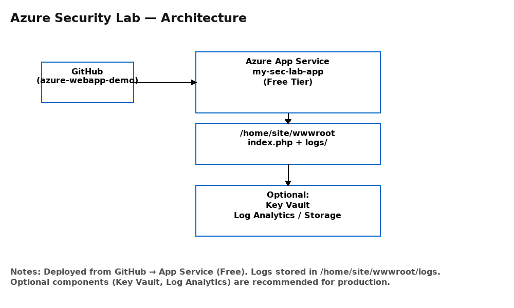
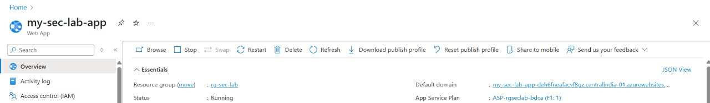
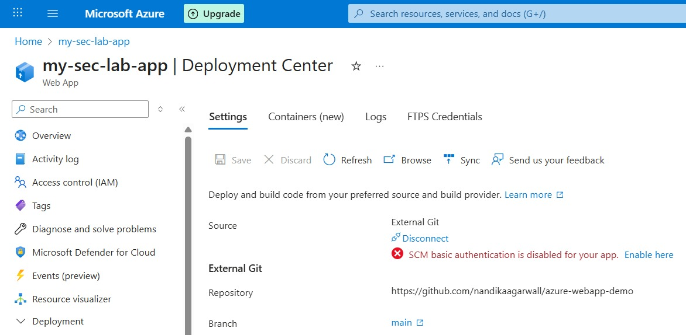
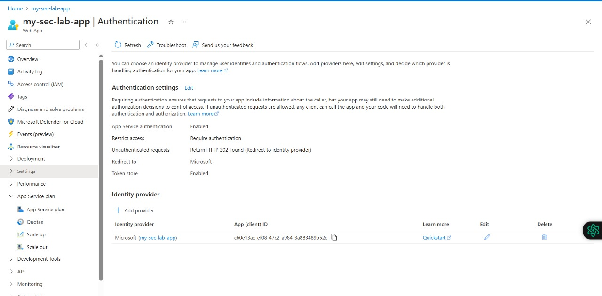
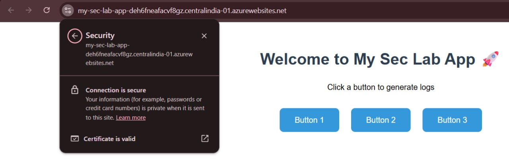
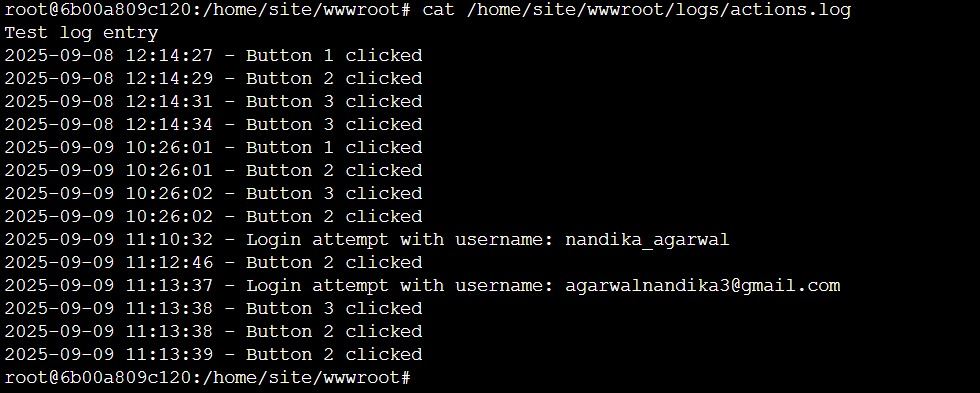
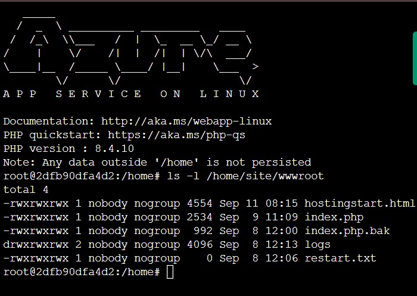
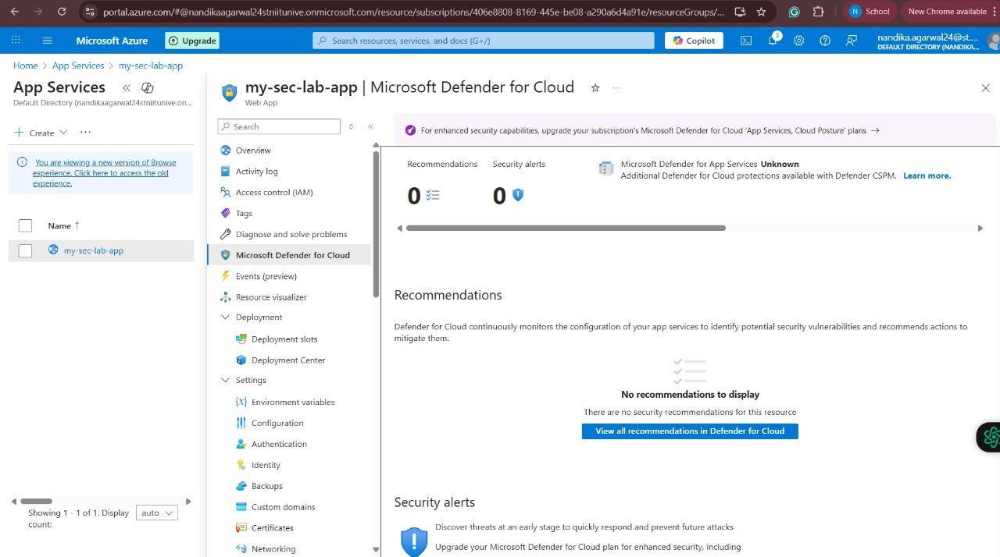
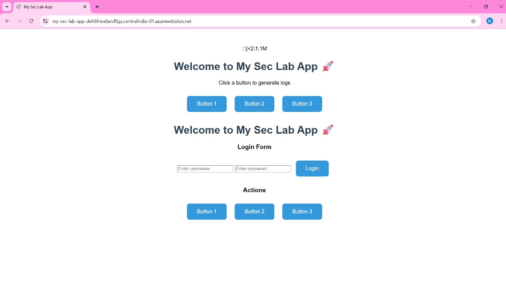

# Azure Web App Security Lab 🚀

This project demonstrates how to deploy, secure, and monitor a simple web application using **Microsoft Azure Free Tier**.  
It includes authentication, HTTPS/TLS, logging, monitoring, and security baselines — making it a great **portfolio-ready project**.

---

## 🌐 Live Demo

🔗 [Visit the Web App](https://my-sec-lab-app-deh6fneafacvf8gz.centralindia-01.azurewebsites.net)

---

## 🏗️ Architecture

The high-level architecture of this project:

---

## 📸 Screenshots

### 1. App Service Overview  
App Service overview — shows running app and Azure app URL.

### 2. Deployment Center  

### 3. Authentication Setup  

### 4. HTTPS Enforced  

### 5. Log Tail Streaming  

### 6. File Access via Kudu  

### 7. Microsoft Defender – Zero Recommendations  

### 8. Live Demo Web App Page  

---

## 📊 Features Implemented

- ✅ Azure Web App Deployment (Free Tier)  
- ✅ GitHub Repository CI/CD Deployment  
- ✅ Authentication via Microsoft Identity Platform  
- ✅ HTTPS/TLS Enabled  
- ✅ Logging & Monitoring (log stream + custom logs)  
- ✅ Azure Security Center (Defender for Cloud baseline check)  

---

## 📂 Repository Structure
azure-webapp-demo/
│── docs/ # Architecture diagram + screenshots
│── index.html / php # Web app files
│── README.md # Project documentation

---

## 🧑‍💻 Author

👤 Nandika Agarwal  
📧 www.linkedin.com/in/nandikaagarwal

---

